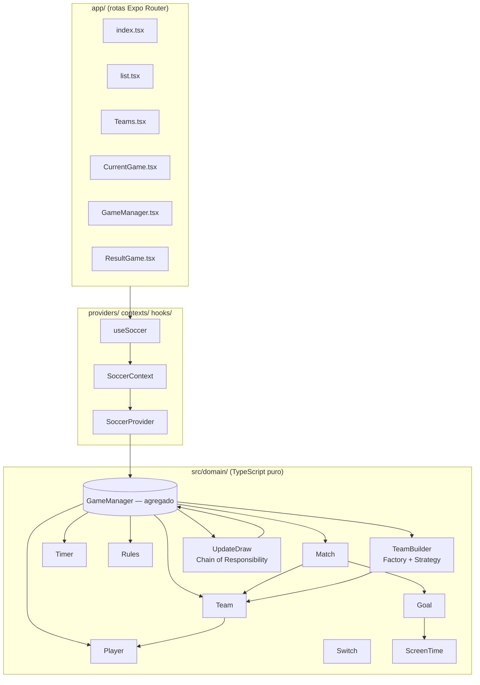
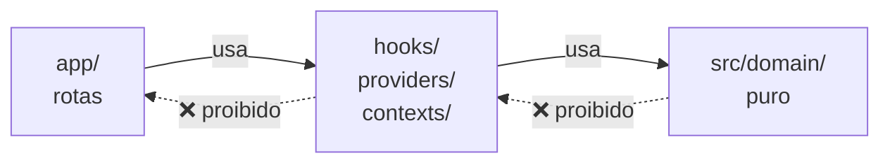

# Arquitetura

O FuteLista é dividido em **três camadas** que se conhecem na ordem certa: rotas → cola React → domínio puro. Nenhuma volta para cima.

> **Esta doc descreve o "o quê" e o "porquê" da arquitetura.** Princípios mais detalhados de código (testes, clean code, lock) ficam em [CLAUDE.md](../../CLAUDE.md). Em vez de duplicar, esta página referencia.

---

## Visão geral



**Regra de ouro:** setas apontam só pra baixo. UI não importa `domain/` direto; domínio não sabe que existe React.

## As três camadas

### 1. `app/` — rotas Expo Router

Roteamento file-based. Cada arquivo dentro de `app/` vira uma rota; pastas viram grupos.

```
app/
├── _layout.tsx          ← Layout raiz: ThemeProvider + MyProviders + Stack
├── +html.tsx            ← HTML wrapper (web only)
├── +not-found.tsx       ← Tela 404
└── (tabs)/              ← Grupo de tabs
    ├── _layout.tsx      ← Define as tabs
    ├── index.tsx        ← Tela inicial
    ├── list.tsx         ← Lista de jogadores
    ├── Teams.tsx        ← Times montados
    ├── CurrentGame.tsx  ← Partida em andamento
    ├── GameManager.tsx  ← Configuração da pelada (UI provisória)
    └── ResultGame.tsx   ← Resultado pós-partida
```

**Componente em rota faz pouco:**

- Lê estado via `useSoccer()`.
- Dispara métodos do `GameManager` em resposta a eventos.
- Renderiza JSX.

Não instancia entidades de domínio. Não decide regras de negócio. Não persiste nada.

Convenções de UI completas em [.claude/rules/mobile.md](../../.claude/rules/mobile.md).

### 2. `providers/`, `contexts/`, `hooks/` — cola React

Responsável por **levar** o domínio até a UI sem que a UI saiba como o domínio funciona.

- **`SoccerProvider`** instancia o `GameManager` uma vez (raiz da árvore) e injeta via Context.
- **`SoccerContext`** é o Context React puro.
- **`useSoccer()`** é o hook que componentes chamam. Devolve o `GameManager` e (futuramente) seletores.

**Reatividade.** O `GameManager` implementa o contrato de _external store_ do React (`subscribe()` + `version`):

```ts
// Trecho simplificado de GameManager.ts
get version(): number { return this._version; }
subscribe(listener: () => void): () => void { ... }
private notify(): void { this._version++; this.listeners.forEach(l => l()); }
```

Toda operação que muda estado chama `notify()` no final. O `Timer` recebe um callback `onChange` para que os ticks também notifiquem. Componentes consomem isso via [`useGameSlice`](../../hooks/useGameSlice.ts) (que envelopa `useSyncExternalStore`). A motivação completa dessa escolha — incluindo as alternativas descartadas (imutabilidade, Zustand, `setState([])`) — está em [ADR-0002](../adr/0002-reatividade-external-store.md).

### 3. `src/domain/` — domínio puro

Coração do app. Toda regra de negócio mora aqui.

**O que NÃO pode entrar:**

- `react`, `react-native`, `expo-*`.
- `AsyncStorage`, `fetch`, `axios`.
- `View`, `Text`, `Animated`.
- Cliente externo (Firebase, Sentry, analytics…).

**Exceção:** `import 'react-native-get-random-values'` antes de `import * as uuid from 'uuid'` — polyfill obrigatório para o `uuid.v4()` rodar no JS engine do React Native.

Regras detalhadas em [.claude/rules/domain.md](../../.claude/rules/domain.md). Referência das entidades em [dominio.md](dominio.md).

## Por que essa separação

Três motivos práticos, não dogmáticos:

1. **Testabilidade.** `src/domain/` é puro → roda em Node, sem mock, sem polyfill (a não ser uuid). Os ~20 specs Jest do domínio rodam em milissegundos.
2. **Portabilidade.** Quando entrar persistência (AsyncStorage hoje, eventualmente um backend), só a cola React muda. Domínio não sabe.
3. **Refatoração de UI sem medo.** Se você decidir trocar Expo Router por Reanimated Navigation, ou colocar Zustand entre o Provider e a UI, o domínio fica intacto.

## Padrões aplicados

### Aggregate Root (DDD)

`GameManager` é o **agregado raiz** da pelada. Toda mudança que afeta múltiplas entidades passa por ele:

- Criar times → `createTeams()`
- Iniciar partida → `setPlayingGame()`
- Adicionar gol → `addGoal(team, player)`
- Atualizar próximos → `setNextMatch(externalAdvantage?)`

Componentes **nunca** instanciam `Player`/`Team`/`Match` diretamente; sempre vão pelo `GameManager`.

### Factory + Strategy — modos de escolha de times

Em [src/domain/TeamBuilder/](../../src/domain/TeamBuilder/):

- Cada `ChoosingTeams` é uma **strategy** com a mesma interface (`create(players, perTeam)`).
- A **factory** (`CreateTeamFactory.fabricate(mode)`) devolve a strategy certa.
- Adicionar um quarto modo = criar strategy + registrar no factory + escrever spec. Sem tocar `GameManager`.

### Chain of Responsibility — pós-partida

Em [src/domain/UpdateDraw/](../../src/domain/UpdateDraw/):

Quatro handlers em sequência decidem quem segue após a partida:

1. `WithVictory`
2. `WithDrawAndAdvantageAndTwoTeams`
3. `WithDrawAndAdvantageAndNotTwoTeams`
4. `WithDrawAndExternalAdvantageAndNotTwoTeams`

O primeiro handler que casa a condição decide. Não há `if/else` aninhado — cada caso é um arquivo, cada arquivo tem teste.

Detalhe das regras: [docs/usuario/regras.md](../usuario/regras.md#vantagem-e-empate).

## Dependências entre camadas (visual)



Seta sólida = depende. Seta tracejada = **proibido** depender. Se você precisar fazer o sentido inverso, está descrevendo a arquitetura errada — pare e reveja o desenho.

## Onde mora a documentação dos princípios

Esta doc descreve **estrutura**. Os **princípios de engenharia** (Clean Code, DDD pragmático, testes, não-regressão, lock de funcionalidades) ficam em:

- [CLAUDE.md](../../CLAUDE.md) — guia para agentes de IA, autoritativo.
- [.claude/rules/domain.md](../../.claude/rules/domain.md) — regras do domínio.
- [.claude/rules/mobile.md](../../.claude/rules/mobile.md) — regras da UI.
- [.claude/rules/testing.md](../../.claude/rules/testing.md) — regras de teste.

Se houver conflito entre essas fontes e esta página, `CLAUDE.md` vence.

## Próximo passo

→ [Referência do domínio](dominio.md) — entidades, métodos, contratos.
→ [Camada UI](ui.md) — telas, provider, fluxo de re-render.
