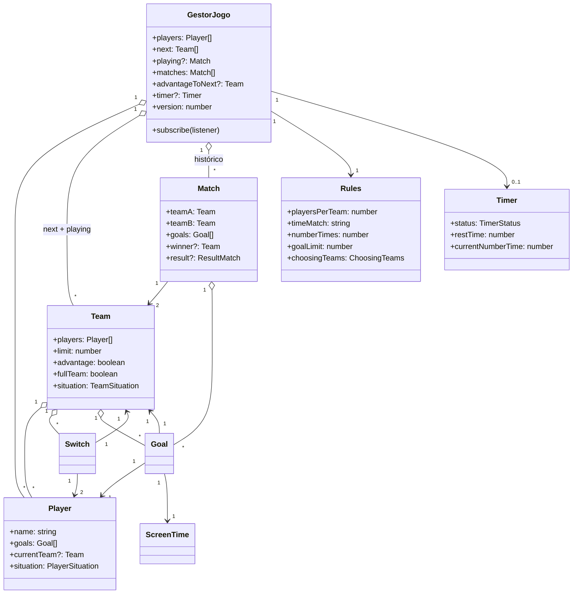

# Referência do domínio

Esta página descreve **cada entidade** de `src/domain/`: propósito, propriedades, métodos principais, invariantes.

> Pureza, casing de imports, padrões aceitos e regras de teste estão em [.claude/rules/domain.md](../../.claude/rules/domain.md). Aqui é referência de **conteúdo**.

---

## Mapa das entidades

## `GestorJogo` — agregado raiz

Arquivo: [src/domain/GestorJogo.ts](../../src/domain/GestorJogo.ts).

Ponto único de entrada para tudo que muda a pelada. Implementa _external store_ (subscribe + version) para integração com React via `useSyncExternalStore`.

### Estado

| Propriedade           | Tipo            | Significado                                      |
| --------------------- | --------------- | ------------------------------------------------ |
| `players`             | `Player[]`      | Todos os jogadores cadastrados na pelada.        |
| `next`                | `Team[]`        | Fila de times esperando jogar.                   |
| `playing`             | `Match?`        | Partida em andamento (se houver).                |
| `matches`             | `Match[]`       | Histórico de partidas encerradas.                |
| `advantageToNext`     | `Team?`         | Time que tem direito à vantagem na próxima.      |
| `timer`               | `Timer?`        | Cronômetro da partida atual.                     |
| `playersWithoutTeam`  | `number`        | Contador de jogadores ainda sem time.            |
| `rules`               | `Rules`         | Regras da pelada (imutáveis após criação).       |
| `version`             | `number` (get)  | Monotônico — incrementa a cada `notify()`.       |

### Métodos principais

| Método                         | Faz                                                                       |
| ------------------------------ | ------------------------------------------------------------------------- |
| `addPlayer(name)`              | Cria e adiciona um jogador.                                               |
| `setPlayers(names)`            | Substitui a lista por jogadores criados a partir desses nomes.            |
| `createTeams()`                | Monta a fila `next` usando a strategy do `choosingTeams`.                 |
| `setPlayingGame()`             | Tira os 2 primeiros de `next` e cria a `Match` em `playing`.              |
| `start() / pause() / continue()` | Controla o `Timer` da partida atual.                                    |
| `addGoal(team, player)`        | Registra um gol na partida atual (com instante via `Timer.getTime()`).    |
| `setResult()`                  | Computa vencedor/empate ao final da partida.                              |
| `setNextMatch(externalAdv?)`   | Aplica a chain do `FinalResult` e prepara a próxima partida.               |
| `switchPlayerFromTeam(p1, p2)` | Troca dois jogadores entre os times deles (durante a partida).            |
| `switchPlayerLeft(in, out)`    | Substitui um jogador em campo por um da fila.                             |
| `removeFromGame(player)`       | Tira o jogador da pelada; redimensiona times automaticamente.             |

Todo método público que muta estado chama `notify()` no final.

### Invariantes

- Não pode haver duas chamadas de `createTeams()` (lança "Times já foram criados").
- Não pode haver duas chamadas de `setPlayingGame()` sem encerrar a anterior (lança "Já existe uma partida acontecendo").

## `Rules`

Arquivo: [src/domain/Rules.ts](../../src/domain/Rules.ts).

Política da pelada. **Imutável** após criação (mudanças exigem criar um novo `Rules`).

| Propriedade        | Default     | Validação                       |
| ------------------ | ----------- | ------------------------------- |
| `playersPerTeam`   | 4           | ≥ 1                             |
| `timeMatch`        | `00:10:00` | ≥ 30 s (convertido via `toSeconds`) |
| `numberTimes`      | 1           | ≥ 1                             |
| `goalLimit`        | 2           | ≥ 1                             |
| `choosingTeams`    | `BY_ORDER` | valor do enum `ChoosingTeams`   |
| `name`             | `"Padrão"` | livre                           |
| `id`               | uuid v4     | gerado se omitido               |

Cada validação lança erro com mensagem **em português específica**. Essas mensagens são parte do contrato — alterar exige atualizar `Rules.spec.ts`.

**Enum `ChoosingTeams`:** `BY_ORDER`, `BY_ORDER_MIXING_TOP_TWO_TEAMS`, `BY_MIXING_TEAMS`. Significado em [docs/usuario/regras.md](../usuario/regras.md#modos-de-escolha-de-times).

## `Player`

Arquivo: [src/domain/Player.ts](../../src/domain/Player.ts).

| Propriedade    | Tipo                | Notas                                                    |
| -------------- | ------------------- | -------------------------------------------------------- |
| `id`           | uuid                | Gerado no construtor.                                    |
| `name`         | `string`            | Único campo obrigatório no construtor.                   |
| `goals`        | `Goal[]`            | Histórico de gols feitos por ele.                        |
| `teams`        | `Team[]`            | Times pelos quais já passou nessa pelada.                |
| `matches`      | `Match[]`           | Partidas em que esteve em campo.                         |
| `currentTeam`  | `Team?`             | Time atual; `undefined` se está parado.                  |
| `situation`    | `PlayerSituation`   | `NO_TEAM`, `ACTIVE`, `STOPPED`.                          |

Métodos: `addGoal(goal)`, `addTeam(team)`, `addMatch(match)`, `setSituation(s)`. Cada um valida pertencimento (gol é dele, time tem ele, partida envolve um dos times dele).

**Enum `PlayerSituation`:**

- `NO_TEAM` — cadastrado mas ainda não foi alocado.
- `ACTIVE` — está em um time.
- `STOPPED` — saiu (removido ou sai por troca).

## `Team`

Arquivo: [src/domain/Team.ts](../../src/domain/Team.ts).

| Propriedade    | Tipo                | Notas                                                     |
| -------------- | ------------------- | --------------------------------------------------------- |
| `id`           | uuid                | Gerado no construtor.                                     |
| `limit`        | `number`            | Tamanho do time (vem de `Rules.playersPerTeam`).          |
| `players`      | `Player[]`          | Membros atuais.                                           |
| `fullTeam`     | `boolean`           | Recomputado a cada add/remove (`players.length === limit`). |
| `advantage`    | `boolean`           | Tem vantagem para a próxima partida?                      |
| `victories`    | `number`            | Vitórias na pelada.                                       |
| `draws`        | `number`            | Empates na pelada.                                        |
| `loses`        | `number`            | Derrotas na pelada.                                       |
| `goals`        | `Goal[]`            | Todos os gols feitos (e contra, com `ownGoal: true`).    |
| `Switches`     | `Switch[]`          | Histórico de substituições.                               |
| `matches`      | `Match[]`           | Partidas que disputou.                                    |
| `situation`    | `TeamSituation`     | `CREATED`, `PLAYING`, `STOPPED`, `ON_NEXT`.               |

Métodos: `addPlayer`, `removePlayer`, `removeNewestPlayer`, `hasPlayer`, `switchPlayer(in, out)`, `addGoal`, `addMatch`, `setSituation`.

**Atenção ao `switchPlayer`:** o `splice(index, 1)` é proposital — sem o segundo argumento, `splice(index)` removia do índice ao fim, esvaziando times maiores que 1. Comentário no código preserva a história.

## `Match`

Arquivo: [src/domain/Match.ts](../../src/domain/Match.ts).

| Propriedade   | Tipo               | Notas                                          |
| ------------- | ------------------ | ---------------------------------------------- |
| `teamA`       | `Team`             | Imutável após construção.                      |
| `teamB`       | `Team`             | Imutável após construção.                      |
| `teams`       | `Set<Team>`        | `{teamA, teamB}` — útil pra `has()`.           |
| `goals`       | `Goal[]`           | Gols na ordem em que aconteceram.              |
| `winner`      | `Team?`            | Definido após `setResult()` se houve vencedor. |
| `loser`       | `Team?`            | Idem.                                          |
| `result`      | `ResultMatch?`     | `VICTORY` ou `DRAW`.                           |

Métodos: `countGoals()` (devolve `{teamA, teamB}`), `setResult()`, `addGoal(team, player, screenTime)`, `getOtherTeam(team)`, `switchPlayer(in, out, team)`.

**Gol contra (`ownGoal`):** se o jogador autor **não pertence** ao time creditado, o gol é registrado como `ownGoal: true` e **não é somado** ao histórico do jogador.

## `Goal`

Arquivo: [src/domain/Goal.ts](../../src/domain/Goal.ts).

Registro imutável de um gol. Guarda referências ao `Match`, `Player`, `Team`, `ScreenTime` e a flag `ownGoal`.

## `ScreenTime`

Arquivo: [src/domain/ScreenTime.ts](../../src/domain/ScreenTime.ts).

Value Object com dois campos: `stroke` (em qual tempo da partida) e `timeStroke` (quantos segundos do início desse tempo). Imutável.

## `Switch`

Arquivo: [src/domain/Switch.ts](../../src/domain/Switch.ts).

Registro de uma substituição: `playerEnters`, `playerLeaves`, `team`. Imutável.

## `Timer`

Arquivo: [src/domain/Timer.ts](../../src/domain/Timer.ts).

Cronômetro da partida. Aceita callback `onChange` no construtor — usado pelo `GestorJogo` pra que cada tick dispare `notify()` na árvore React.

| Propriedade            | Tipo               | Notas                                           |
| ---------------------- | ------------------ | ----------------------------------------------- |
| `status`               | `TimerStatus`      | `CREATED`, `STARTED`, `PAUSED`, `INTERVAL`, `ENDED`. |
| `restTime`             | `number`           | Segundos restantes no tempo atual.              |
| `currentNumberTime`    | `number`           | Qual tempo está rolando (1, 2, …).              |
| `numberTimes`          | `number` (readonly)| Quantos tempos a partida tem.                   |
| `timeMatch`            | `number` (readonly)| Duração de cada tempo, em segundos.             |

Métodos: `start()`, `pause()`, `continue()`, `stop()`, `getTime()` (devolve `ScreenTime` do instante atual).

**Máquina de estados:** [docs/usuario/fluxo-pelada.md → diagrama do Timer](../usuario/fluxo-pelada.md#4-iniciar-a-partida).

## `TeamBuilder/` — Factory + Strategy

Pasta: [src/domain/TeamBuilder/](../../src/domain/TeamBuilder/).

Cria a lista inicial de `Team[]` a partir da lista de `Player[]` e do `choosingTeams`.

- Cada strategy implementa `create(players: Player[], perTeam: number): Team[]`.
- `CreateTeamFactory.fabricate(mode)` devolve a strategy correta.

**Adicionar um quarto modo:**

1. Adicione o valor no enum `ChoosingTeams` (em `Rules.ts`).
2. Crie a strategy em `TeamBuilder/`.
3. Registre no factory.
4. Escreva o `*.spec.ts`.

Sem tocar `GestorJogo`, sem `if` extra.

## `FinalResult/` — Chain of Responsibility

Pasta: [src/domain/FinalResult/](../../src/domain/FinalResult/).

Decide o que acontece **depois** que `Match.setResult()` rodou:

| Ordem | Handler                                          | Condição                                          |
| ----- | ------------------------------------------------ | ------------------------------------------------- |
| 1     | `WithVictory`                                    | Houve vencedor.                                   |
| 2     | `WithDrawAndAdvantageAndTwoTeams`                | Empate + vantagem prévia + fila com 2+ times.     |
| 3     | `WithDrawAndAdvantageAndNotTwoTeams`             | Empate + vantagem prévia + fila parcial.          |
| 4     | `WithDrawAndExternalAdvantageAndNotTwoTeams`     | Empate + ninguém tinha vantagem (decisão manual). |

O `FinalResultProcessor.process({game, externalAdvantage})` percorre a chain; o primeiro handler que aceita decide.

Significado de negócio em [docs/usuario/regras.md](../usuario/regras.md#vantagem-e-empate).

## Enums (contrato)

Esses enums são **contrato público** do domínio. Mudar nome/valor exige revisar todos os consumidores e testes.

| Enum               | Valores                                                          |
| ------------------ | ---------------------------------------------------------------- |
| `PlayerSituation`  | `STOPPED`, `ACTIVE`, `NO_TEAM`                                   |
| `TeamSituation`    | `PLAYING`, `STOPPED`, `ON_NEXT`, `CREATED`                       |
| `TimerStatus`      | `CREATED`, `STARTED`, `PAUSED`, `INTERVAL`, `ENDED`              |
| `ResultMatch`      | `DRAW`, `VICTORY`                                                |
| `ChoosingTeams`    | `BY_ORDER`, `BY_ORDER_MIXING_TOP_TWO_TEAMS`, `BY_MIXING_TEAMS`   |

## Quando adicionar uma classe nova

Roteiro pragmático:

1. **Tem invariante de negócio?** Vira entidade ou Value Object.
2. **É só dados sem comportamento?** Use `type`/`interface`.
3. **Tem variação de comportamento (3+ casos)?** Strategy + Factory (siga `TeamBuilder`).
4. **Cadeia de decisões mutuamente excludentes?** Chain of Responsibility (siga `FinalResult`).
5. **Crie o `*.spec.ts` antes ou junto** da implementação.

## Próximo passo

→ [Arquitetura geral](arquitetura.md).
→ Regras de UI que consomem o domínio: [.claude/rules/mobile.md](../../.claude/rules/mobile.md).
