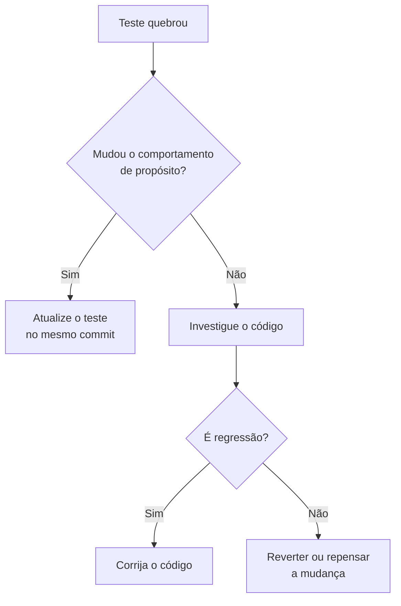

# Testes

Como rodar, como escrever e o que **não** fazer.

> Convenções autoritativas estão em [.claude/rules/testing.md](../../.claude/rules/testing.md). Esta página é a versão amigável com exemplos.

---

## Stack

- **Jest** com preset `jest-expo` (configurado em [package.json](../../package.json)).
- **react-test-renderer** para snapshot de componentes simples.
- TypeScript estrito — testes são `.spec.ts` (ou `.tsx` quando renderizam componente).

## Comandos

| Comando                       | O que faz                                                              |
| ----------------------------- | ---------------------------------------------------------------------- |
| `npm test`                    | Jest em **watch mode** (re-roda ao salvar). Default do dia a dia.      |
| `npx jest`                    | Roda uma vez. Use em CI ou pre-commit.                                 |
| `npx jest Player`             | Roda só testes que casam o padrão `Player` no nome.                    |
| `npx jest --coverage`         | Gera relatório de cobertura.                                           |
| `npx jest -u`                 | Atualiza snapshots (use depois de mudar componente de propósito).      |

## Onde mora cada teste

| Tipo                | Localização                                  | Padrão de nome                     |
| ------------------- | -------------------------------------------- | ---------------------------------- |
| Domínio             | Co-localizado: `src/domain/Player.spec.ts`   | `*.spec.ts`                        |
| Componentes simples | `components/__tests__/`                      | `*-test.tsx` (padrão do template)  |

**Co-localizar** o teste do domínio é proposital: quando alguém abre `Player.ts`, encontra `Player.spec.ts` do lado e sabe que está coberto.

## Convenções

### Idioma

Em português, descrevendo o **esperado**:

```ts
describe("Player", () => {
  it("deverá começar com situação NO_TEAM", () => { ... });
  it("não deverá aceitar gol de outro jogador", () => { ... });
});
```

### Estrutura

- `describe` = unidade testada (classe, hook, componente).
- `it` ou `test` = comportamento esperado.
- Um `expect` por cenário lógico. Mais que isso, divida em `it`s.

### F.I.R.S.T.

Os testes devem ser:

- **Fast** — milissegundos. Domínio puro = rapidíssimo.
- **Independent** — não compartilham estado entre `it`s. Use `beforeEach` para preparar.
- **Repeatable** — mesma entrada, mesma saída. Sem `Date.now()` real; use fake timers.
- **Self-validating** — `expect(...)`. Sem inspecionar log na mão.
- **Timely** — escritos junto (ou antes) da implementação.

### Time real → fake timer

`Timer` decrementa via `setInterval(..., 1000)`. **Nunca** use `setTimeout(..., 2000)` no teste — fake timer resolve:

```ts
import { Timer, TimerStatus } from "./Timer";

describe("Timer", () => {
  beforeEach(() => jest.useFakeTimers());
  afterEach(() => jest.useRealTimers());

  it("deverá decrementar 1s a cada tick", () => {
    const timer = new Timer(1, 10);
    timer.start();
    jest.advanceTimersByTime(1000);
    expect(timer.restTime).toBe(9);
  });
});
```

## O que cobrir

### Domínio (`src/domain/`)

Para cada arquivo:

1. **Caminho feliz** — o uso normal funciona.
2. **Invariantes** — limites, erros, contratos.

Exemplo:

```ts
describe("Rules", () => {
  it("deverá criar as regras default", () => {
    const rules = new Rules();
    expect(rules.playersPerTeam).toBe(4);
    expect(rules.choosingTeams).toBe(ChoosingTeams.BY_ORDER);
  });

  it("não deverá aceitar menos de 1 jogador por time", () => {
    expect(() => new Rules({ playersPerTeam: 0 })).toThrow(
      "Limite mínimo de jogadores por time é 1.",
    );
  });
});
```

### Bug fix

**Sempre** começa com um teste que **falha antes** do fix e **passa depois**. É como você prova que o bug existia e que está resolvido. Se você não consegue escrever esse teste, não entendeu o bug ainda.

### Componentes

Testar **comportamento observável** — texto renderizado, handler chamado em resposta a evento. **Não** teste implementação interna (`useState` foi chamado, etc.).

## O que NÃO fazer

❌ **Mockar entidades de domínio entre si.** `Match` e `Team` se conhecem de verdade no app — mockar uma quebra o grafo natural e o teste fica falso. Use as classes reais.

❌ **`setTimeout(..., 2000)` para "esperar".** Use `jest.useFakeTimers()` + `advanceTimersByTime()`.

❌ **`it.skip` / `describe.only` em main.** Esse é cheiro clássico de teste deixado pela metade.

❌ **Copiar a estrutura de outro teste sem pensar.** Cada teste é um cenário nomeável. Se você não sabe o que está validando, deleta.

❌ **"Ajustar o teste para passar".** Investigue antes: o comportamento mudou de propósito (atualize o teste) ou quebrou de fato (corrija o código)?

❌ **`console.log` em teste.** Se precisa investigar, use o debugger. Se passou, tira antes do commit.

## Padrões já estabelecidos

### `Match.spec.ts`, `Team.spec.ts`, `GameManager.spec.ts`

Mostram o padrão de **grafo natural**: testar com `Player`, `Team`, `Match` reais, sem mocks entre eles. Use como referência.

### `Game.spec.ts`

Cobre cenários ponta a ponta do `GameManager`: criar pelada, adicionar jogadores, fazer times, jogar partida, ver fila atualizar. Se você for adicionar um caso novo de pós-partida (chain do `UpdateDraw`), ele provavelmente entra aqui também — não só em `UpdateDraw/*.spec.ts`.

### Casing de imports em testes

Mesma regra do domínio: `import { Player } from "./Player"`, **não** `"./player"`. CI Linux é case-sensitive e quebra.

## Quando o teste quebra



**Regra final:** se a mudança quebra cobertura ou teste, a tarefa **não está pronta**. Investigue antes de fechar.

## Próximo passo

→ [Como buildar e publicar](build-release.md). _(em construção)_
→ [Regras completas](../../.claude/rules/testing.md).
