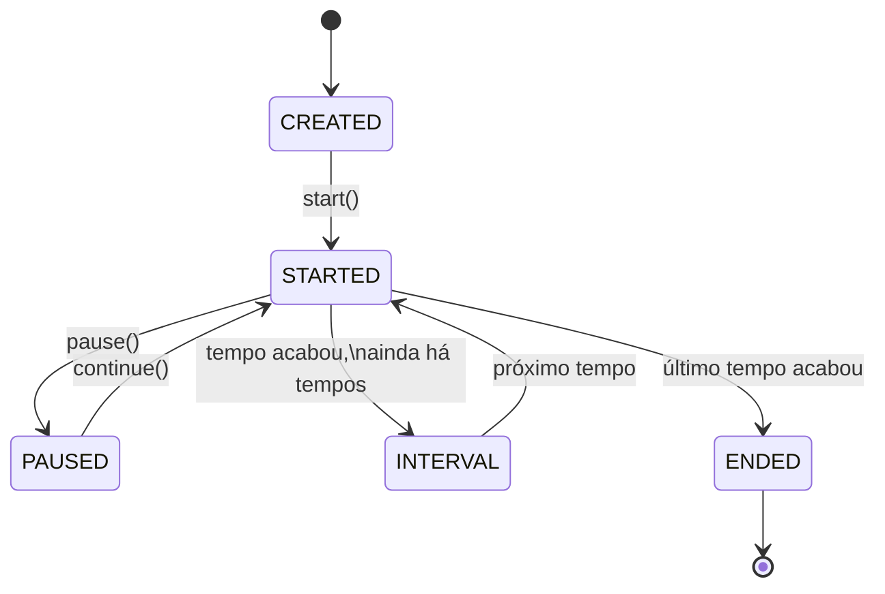
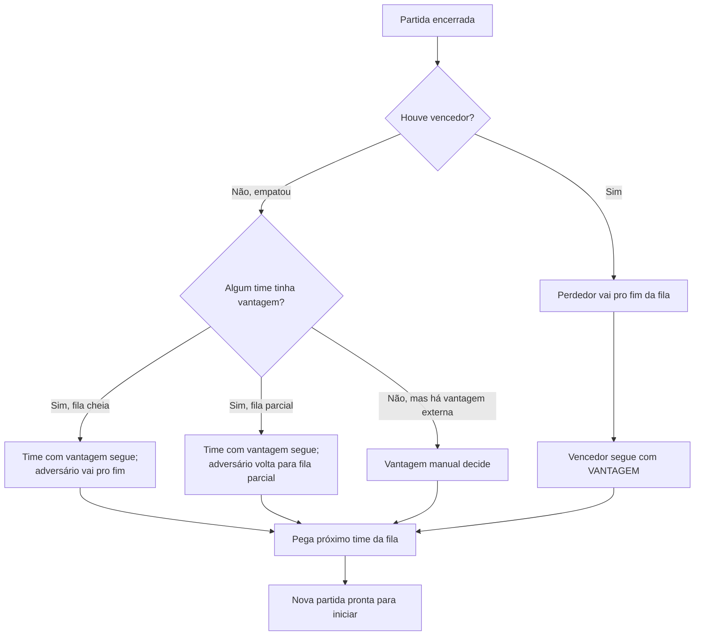

# Fluxo de uma pelada

Este documento mostra **o caminho completo**: do "abri o app" até "encerrei a noite".

> Os nomes de tela aqui ainda refletem a UI provisória (`index`, `list`, `Teams`, `GameManager`, `CurrentGame`). Quando a UI for renomeada para PT (planejado em [COMMITS_PLAN.md](../../COMMITS_PLAN.md)), esta doc é atualizada junto.

---

## 1. Criar a pelada

Tela inicial (`app/(tabs)/index.tsx`).

- Você define o **nome** da pelada e as **regras** (ver [regras.md](regras.md)).
- Internamente, isso cria um `GameManager` e um `Rules` no domínio.
- Estado inicial: zero jogadores, zero times, sem partida ativa.

## 2. Cadastrar jogadores

Tela de lista (`app/(tabs)/list.tsx`).

- Adicione cada jogador pelo nome.
- A ordem importa nos modos `BY_ORDER` e `BY_ORDER_MIXING_TOP_TWO_TEAMS` — o primeiro a chegar é o primeiro a jogar.
- Cada jogador nasce com `situation = NO_TEAM`. Ao entrar num time, passa para `ACTIVE`.

## 3. Montar os times

Tela de times (`app/(tabs)/Teams.tsx`).

- O app monta os times conforme `playersPerTeam` e o `modo de escolha` que você definiu nas regras.
- Times completos viram da fila de **próximos**.
- Se sobrar jogador (não fecha N por time), ele entra no **último time parcial**.

Detalhe técnico: a escolha é implementada via **Factory + Strategy** em [src/domain/TeamBuilder](../../src/domain/TeamBuilder). Cada modo é uma strategy independente.

## 4. Iniciar a partida

Tela de partida atual (`app/(tabs)/CurrentGame.tsx`).

- O app pega os **dois primeiros** times de `próximos` e cria uma `Partida`.
- O `Timer` é criado com base nas regras (tempo + número de tempos) e começa parado (`CREATED`).
- Você toca em **iniciar** → o `Timer` vai para `STARTED` e começa a contar.

Estados possíveis do `Timer`:

## 5. Marcar gols

Durante a partida:

- Você toca em **gol** e escolhe **qual time** e **qual jogador** marcou.
- O `Goal` registra o instante (`ScreenTime`: qual tempo + segundo do tempo) e se foi **gol contra** (jogador não pertence ao time que marcou).
- O placar aparece em tempo real.

Se o gol foi contra (autor não joga no time que recebeu o crédito), o app não credita ao jogador — só ao time.

## 6. Encerrar a partida

A partida encerra de duas formas:

1. **Tempo acabou** — `Timer` chega a `ENDED`.
2. **Gols-limite atingido** — algum time bateu `goalLimit` (você define nas regras; padrão 2).

Você confirma o encerramento e o app:

- Conta os gols (`Match.countGoals`).
- Decide se foi `VICTORY` (vencedor + perdedor definidos) ou `DRAW`.
- Salva no histórico (`matches` do `GameManager`).

## 7. Atualizar os próximos

Aqui mora a **lógica que evita discussão**. O app aplica uma **cadeia de regras** (Chain of Responsibility em [src/domain/UpdateDraw](../../src/domain/UpdateDraw)) e decide quem segue:

**Vantagem** é simplesmente uma flag (`advantage: boolean`) no `Team`. Quem vence ganha vantagem para o próximo confronto; quem empata sem vantagem prévia perde a chance.

Detalhes da regra em [regras.md](regras.md#vantagem-e-empate).

## 8. Trocas, jogador parado, jogador entrou depois

Durante uma partida você pode:

- **Trocar jogador entre times** (`switchPlayerFromTeam`): troca um por outro.
- **Trocar jogador com a fila** (`switchPlayerLeft`): tira um do time que está jogando e bota um que estava esperando.
- **Remover jogador da pelada** (`removeFromGame`): jogador sai da quadra de vez. O app **redimensiona os times** automaticamente puxando alguém da fila pra fechar o time.

Tudo isso passa pelo `GameManager` — não fica espalhado pela UI.

## 9. Encerrar a noite

Hoje **não há tela de encerramento**. Você simplesmente fecha o app. Como ainda **não há persistência**, isso descarta a pelada.

Quando persistência entrar (planejada), a pelada poderá ser salva e retomada.

## Próximo passo

→ Entenda as regras em detalhe: [regras.md](regras.md).
→ Quer mexer no código? [Arquitetura para devs](../desenvolvedor/arquitetura.md).
