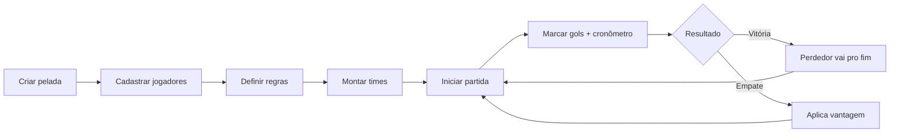

# Primeiros passos

Guia para quem vai **usar** o FuteLista pela primeira vez.

> ⚠️ O app ainda **não está publicado** nas lojas. Por enquanto, ele roda em ambiente de desenvolvimento (Expo Go ou build local). Veja [instalação para devs](../desenvolvedor/instalacao.md) se quiser rodar agora. Detalhes sobre quando e como publicar: [build-release.md](../desenvolvedor/build-release.md).

---

## O que o FuteLista faz

Organiza a sua pelada do início ao fim:

1. Você **cadastra** os jogadores que vieram.
2. O app **monta os times** conforme a regra que você escolheu.
3. Você joga as **partidas**, marca os **gols**, controla o **tempo**.
4. No fim de cada partida, o app **atualiza a fila** (próximos): quem ganhou fica, quem perdeu vai pro final.
5. Em **empate**, o app aplica a regra de **vantagem** (quem tinha o direito de seguir, segue).

A ideia é eliminar discussão na quadra: "quem joga o próximo?", "esse time já tinha vantagem?", "quanto tempo falta?" — tudo fica registrado.

## Conceitos que você vai ver

Todos em português, todos consistentes (no app, nesta doc e no código):

- **Pelada** — a sessão inteira que você está organizando.
- **Jogador** — quem veio jogar.
- **Time** — grupo formado por N jogadores (você define o N nas regras).
- **Partida** — um jogo entre dois times.
- **Próximos** — fila dos times que ainda não jogaram.
- **Vantagem** — direito de seguir na próxima partida quando der empate.

Detalhes sobre vantagem e empate: [regras.md](regras.md).

## Fluxo típico de uma pelada

Passo a passo detalhado: [fluxo-pelada.md](fluxo-pelada.md).

## Regras que você define no início

Quando cria a pelada, você escolhe:

| Regra                  | O que significa                                                  | Padrão     |
| ---------------------- | ---------------------------------------------------------------- | ---------- |
| Jogadores por time     | Tamanho de cada time                                             | 4          |
| Tempo da partida       | Duração de cada tempo (formato `HH:MM:SS`)                       | `00:10:00` |
| Número de tempos       | Quantos tempos cada partida tem                                  | 1          |
| Gols-limite            | Quantos gols encerram a partida antes do tempo                   | 2          |
| Modo de escolha        | Como o app monta os times (`BY_ORDER`, `BY_MIXING_TEAMS`, etc.) | Por ordem  |

Os três modos de escolha de times estão explicados em [regras.md](regras.md#modos-de-escolha-de-times).

## Limites de hoje (conscientes)

Antes de usar pra valer, saiba o que ainda não tem:

- **Sem persistência.** Se o app fechar (ou recarregar), a pelada em andamento **se perde**.
- **Sem histórico entre peladas.** Cada vez que abre, começa do zero.
- **Sem login/cloud sync.** Cadastro de jogador não viaja entre dispositivos.
- **UI em construção.** Algumas telas têm nome interno provisório (`GestorJogo`, `CurrentGame`) que vão virar nomes em português depois.

Esses pontos estão no [roteiro de melhorias](../../COMMITS_PLAN.md).

## Próximo passo

→ Acompanhe um exemplo completo em [fluxo-pelada.md](fluxo-pelada.md).
